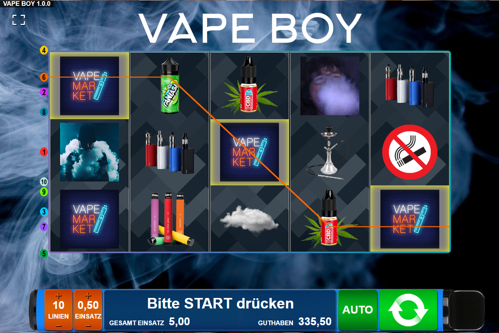

<!-- PROJECT LOGO -->
 

  
  <h3 align="center">VapeBoySlots</h3>
  

    Slot Machine made using jQuery-jSlots.
     
     
    <a href="https://vbs.bastianleicht.de">View Demo</a>
    ·
    <a href="https://github.com/bastianleicht/VapeBoySlots/issues">Report Bug</a>
  

<!-- TABLE OF CONTENTS -->

<h2 style="display: inline-block">Table of Contents</h2>

  <ol>
    <li>
      <a href="#about-the-project">About The Project</a>
    </li>
    <li><a href="#license">License</a></li>
    <li><a href="#acknowledgements">Acknowledgements</a></li>
  </ol>

<!-- ABOUT THE PROJECT -->
## About The Project

VapeBoySlots is a slot machine created for a school project.

<!-- LICENSE -->
## License

Distributed under the BSD 2-Clause License. See `LICENSE` for more information.

<!-- ACKNOWLEDGEMENTS -->
## Acknowledgements

* Based on [jQuery jSlots Plugin](https://matthewlein.com/tools/jquery-jslots)
* The Images are copied straight from the Internet.
